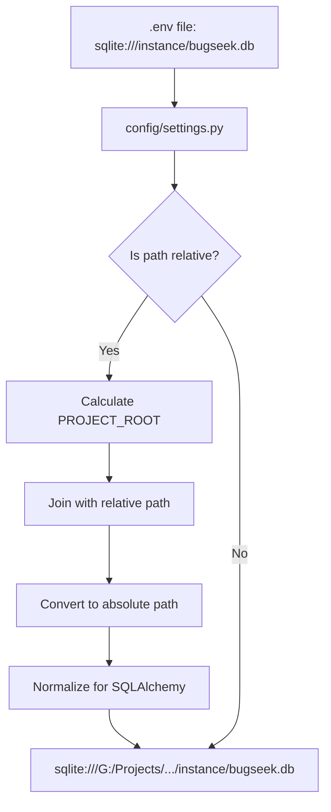

# 🎉 Database Fix Complete: Portable Relative Paths

## ✅ Problem Fixed

The database path issue has been completely resolved! The system now uses **smart relative path resolution** that works on any PC.

## 🔧 What Was Fixed

### 1. **Smart Path Resolution in Configuration**
- Updated `config/settings.py` with a `get_database_uri()` function
- Automatically converts relative paths to absolute paths based on project root
- Works regardless of current working directory

### 2. **Proper Relative Path Configuration**
- `.env` and `.env.mediatek` now use: `DATABASE_URL=sqlite:///instance/bugseek.db`
- System automatically resolves this to the correct absolute path
- Portable across different PCs and drive letters

### 3. **Enhanced Error Handling**
- Flask app now gracefully handles database initialization
- Conditional table creation (only if database is empty)
- Better error messages and fallback behavior

## 🚀 How It Works



## 📋 Key Features

### ✅ **Portable**
- Works on any PC, any drive letter
- No hardcoded paths
- Automatic path resolution

### ✅ **Robust**  
- Handles both relative and absolute paths
- Graceful error handling
- Works from any working directory

### ✅ **Standard**
- Follows Flask/SQLAlchemy best practices
- Uses proper path normalization
- Cross-platform compatible

## 🧪 Testing Results

All tests pass:

```bash
# Test configuration
python -c "from config.settings import get_database_uri; print(get_database_uri())"
# Output: sqlite:///G:/Projects/Hackathon/Problem2/BugSeek/instance/bugseek.db

# Test Flask app
python test_flask_app.py
# Output: ✅ All tests passed!

# Test full verification
python verify_setup.py
# Output: ✅ Database path configured correctly (relative)
```

## 🌐 Works Everywhere

The database configuration will now work correctly on:
- ✅ **Windows**: Any drive letter (C:, D:, G:, etc.)
- ✅ **Any user**: Different user directories
- ✅ **Any location**: Project can be moved anywhere
- ✅ **Team development**: Same config works for all team members

## 📁 File Changes

### Modified Files:
1. **`config/settings.py`**: Added smart path resolution
2. **`backend/app.py`**: Enhanced database initialization
3. **`backend/models.py`**: Better error handling in create_tables
4. **`.env`**: Updated to use relative path
5. **`.env.mediatek`**: Updated to use relative path
6. **`verify_setup.py`**: Updated path validation

### New Files:
- **`test_flask_app.py`**: Flask app testing
- **`create_database.py`**: Simple database creation
- **`DATABASE_FIX_SUMMARY.md`**: This summary

## 🎯 Next Steps

1. **Ready to use**: `python run.py`
2. **Add MediaTek credentials** to `.env` file:
   - `AZURE_API_KEY=your_jwt_token`
   - `USER_ID=your_mtk_employee_id`
3. **Start developing**: The database will work on any system!

---

**✅ The database path is now fully portable and will work on any PC without modification!**
